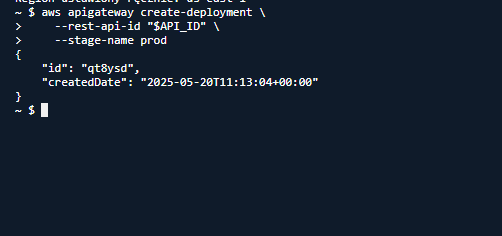

# AWS Serverless API Implementation Guide

## 1. Creating DynamoDB Table

```bash
aws dynamodb create-table \
    --table-name users \
    --attribute-definitions AttributeName=user_id,AttributeType=S \
    --key-schema AttributeName=user_id,KeyType=HASH \
    --provisioned-throughput ReadCapacityUnits=2,WriteCapacityUnits=2
```
 

## 2. Preparing Lambda Functions

```bash
# Package Lambda functions
cd lambda
zip post_user.zip post_user.py
zip get_user.zip get_user.py
cd ..
```

## 3. Creating IAM Role for Lambda

```bash
# Create trust policy file
vim trust-policy.json

# Create role using the trust policy
aws iam create-role --role-name LambdaDynamoDBRole --assume-role-policy-document file://trust-policy.json

# Create policy file
vim policy.json

# Attach policy to role
aws iam put-role-policy --role-name LambdaDynamoDBRole --policy-name DynamoDBAccess --policy-document file://policy.json

# Verify role creation
aws iam get-role --role-name LambdaDynamoDBRole

# Store role ARN for later use
ROLE_ARN=$(aws iam get-role --role-name LambdaDynamoDBRole --query 'Role.Arn' --output text)
echo "Role ARN: $ROLE_ARN"
```


## 4. Creating Lambda Functions

```bash
# Create POST Lambda function
aws lambda create-function \
    --function-name PostUser \
    --runtime python3.9 \
    --handler post_user.lambda_handler \
    --role $ROLE_ARN \
    --zip-file fileb://lambda/post_user.zip

# Create GET Lambda function
aws lambda create-function \
    --function-name GetUser \
    --runtime python3.9 \
    --handler get_user.lambda_handler \
    --role $ROLE_ARN \
    --zip-file fileb://lambda/get_user.zip

# Verify functions are active
aws lambda get-function-configuration --function-name PostUser | grep State
aws lambda get-function-configuration --function-name GetUser | grep State
```

## 5. Creating API Gateway

```bash
# Create REST API
API_ID=$(aws apigateway create-rest-api \
    --name UserAPI \
    --description "API for user management" \
    --endpoint-configuration types=REGIONAL \
    --query 'id' --output text)
echo "API ID: $API_ID"

# Get the root resource ID
ROOT_RESOURCE_ID=$(aws apigateway get-resources \
    --rest-api-id $API_ID \
    --query 'items[0].id' --output text)
echo "Root Resource ID: $ROOT_RESOURCE_ID"


# Create /users resource
USERS_RESOURCE_ID=$(aws apigateway create-resource \
    --rest-api-id $API_ID \
    --parent-id $ROOT_RESOURCE_ID \
    --path-part "users" \
    --query 'id' --output text)
echo "Users Resource ID: $USERS_RESOURCE_ID"


# Create POST method for /users
aws apigateway put-method \
    --rest-api-id $API_ID \
    --resource-id $USERS_RESOURCE_ID \
    --http-method POST \
    --authorization-type NONE

# Get POST Lambda ARN
POST_LAMBDA_ARN=$(aws lambda get-function --function-name PostUser --query 'Configuration.FunctionArn' --output text)
echo "POST Lambda ARN: $POST_LAMBDA_ARN"

# Manually set region if needed
REGION="us-east-1"  # Change to your region
echo "Setting region manually: $REGION"

# Create integration for POST method
aws apigateway put-integration \
    --rest-api-id $API_ID \
    --resource-id $USERS_RESOURCE_ID \
    --http-method POST \
    --type AWS_PROXY \
    --integration-http-method POST \
    --uri "arn:aws:apigateway:$REGION:lambda:path/2015-03-31/functions/arn:aws:lambda:$REGION:$ACCOUNT_ID:function:PostUser/invocations"
```

## 6. Creating User ID Resource

```bash
# Create /{user_id} resource
USER_ID_RESOURCE_ID=$(aws apigateway create-resource \
    --rest-api-id "$API_ID" \
    --parent-id "$USERS_RESOURCE_ID" \
    --path-part "{user_id}" \
    --query 'id' --output text)
echo "User ID Resource ID: $USER_ID_RESOURCE_ID"

# Create GET method for /users/{user_id}
aws apigateway put-method \
    --rest-api-id $API_ID \
    --resource-id $USER_ID_RESOURCE_ID \
    --http-method GET \
    --authorization-type NONE \
    --request-parameters "method.request.path.user_id=true"

# Get GET Lambda ARN
GET_LAMBDA_ARN=$(aws lambda get-function --function-name GetUser --query 'Configuration.FunctionArn' --output text)
echo "GET Lambda ARN: $GET_LAMBDA_ARN"

# Create integration for GET method
aws apigateway put-integration \
    --rest-api-id "$API_ID" \
    --resource-id "$USER_ID_RESOURCE_ID" \
    --http-method GET \
    --type AWS_PROXY \
    --integration-http-method POST \
    --uri "arn:aws:apigateway:$REGION:lambda:path/2015-03-31/functions/arn:aws:lambda:$REGION:$ACCOUNT_ID:function:GetUser/invocations"
```

## 7. Setting Lambda Permissions for API Gateway

```bash
# Add permission for POST Lambda
aws lambda add-permission \
    --function-name PostUser \
    --statement-id apigateway-post \
    --action lambda:InvokeFunction \
    --principal apigateway.amazonaws.com \
    --source-arn "arn:aws:execute-api:$REGION:$ACCOUNT_ID:$API_ID/*/POST/users"

# Add permission for GET Lambda
aws lambda add-permission \
    --function-name GetUser \
    --statement-id apigateway-get \
    --action lambda:InvokeFunction \
    --principal apigateway.amazonaws.com \
    --source-arn "arn:aws:execute-api:$REGION:$ACCOUNT_ID:$API_ID/*/GET/users/{user_id}"

# Create deployment
aws apigateway create-deployment \
    --rest-api-id "$API_ID" \
    --stage-name prod



# Get API URL
API_URL="https://$API_ID.execute-api.$REGION.amazonaws.com/prod"
echo "Your API is available at: $API_URL"
echo "POST Endpoint: $API_URL/users"
echo "Sample GET Endpoint: $API_URL/users/YOUR_USER_ID"
```

## 8. Testing the API

```bash
# List all REST APIs
aws apigateway get-rest-apis

# Get stages for a specific API
aws apigateway get-stages --rest-api-id ID

# Test POST endpoint - creating a user "Jan"
curl -X POST \
  -H "Content-Type: application/json" \
  -d '{"first_name": "Michal", "age": 24}' \
  https://d60eh9l118.execute-api.us-east-1.amazonaws.com/prod/users

# Test POST endpoint - creating a user "Adam"
curl -X POST \
  -H "Content-Type: application/json" \
  -d '{"first_name": "Adam", "age": 25}' \
  https://d60eh9l118.execute-api.us-east-1.amazonaws.com/prod/users

# Test GET endpoint - retrieving a user
curl -X GET "https://d60eh9l118.execute-api.us-east-1.amazonaws.com/prod/users/aa86026f-bcc8-4f69-95f2-0c8bac20e238"
```


### Implementation Notes
 The GET Lambda function implementation required the use of a custom JSON encoder to handle Decimal types returned by DynamoDB. This is a common issue in AWS Lambda when returning numeric values stored as Decimal, which are not directly serializable with json.dumps().

 The age field in DynamoDB is stored as a Decimal, so without a proper encoder, the API would throw:" Object of type Decimal is not JSON serializable".

###  Problems Encountered & Fixes
    The AWS region had to be set manually (REGION="us-east-1") because aws configure get region returned an empty value in my shell environment.

    Although the API was deployed via CLI, I still had to manually confirm the deployment via the AWS Console by clicking “Deploy API” to make it fully operational.

    The GET function needed to be modified to fix the serialization issue with DynamoDB’s Decimal type.

### Approach
    The entire project — including creating the DynamoDB table, IAM role, Lambda functions, API Gateway configuration, permissions, and deployment — was implemented entirely via AWS CLI.

    I chose CLI over the web console because I feel more confident in the terminal and find it easier to debug and understand what is happening under the hood.

## API URL for Testing

https://d60eh9l118.execute-api.us-east-1.amazonaws.com/prod/
d60eh91118.execute-api.us-east-1.amazonaws.com