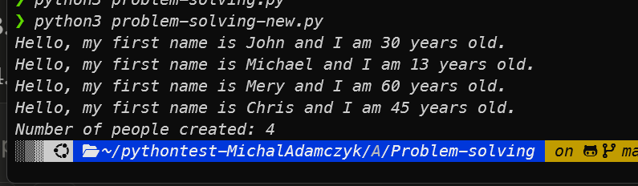

# Debug Report

## Issues Found and Fixed in problem-solving.py

1. **Assignment vs. Comparison Operator**
   - Original: `self.age == age`
   - Fixed: `self.age = age`
   - Issue: The code was using a comparison operator (`==`) instead of assignment operator (`=`), which resulted in the age never being properly assigned.

2. **Missing Parameter in Class Method**
   - Original: `def increase_count():`
   - Fixed: 
     ```python
     @classmethod
     def increase_count(cls):
     ```
   - Issue: The method was missing the `cls` parameter and lacked the `@classmethod` decorator, causing errors when calling it with `self.increase_count()`.

3. **Incorrect Parameter Order**
   - Original: `x = Person(p["first_name"], p["age"], p["last_name"])`
   - Fixed: `x = Person(p["first_name"], p["last_name"], p["age"])`
   - Issue: The parameters were passed in the wrong order when creating a Person object, causing the age and last name to be swapped.

4. **Printing Count Before Threads Complete**
   - Original: Prints count after starting threads, but before they complete
   - Fixed: Added `thread.join()` for each thread before printing the count
   - Issue: The program was displaying the count of created people before all the threads had finished executing.

5. **Incorrect Main Condition Format**
   - Original: `if __name__ == "main":`
   - Fixed: `if __name__ == "__main__":`
   - Issue: The condition to check if the file is run directly was incorrectly formatted, missing the double underscores.

## Implementation Details

To ensure the count is always printed at the end, the script now uses `thread.join()` to wait for each thread to complete before displaying the total number of created people. This approach is more robust than using `time.sleep()` as it waits for the actual completion of each thread rather than a fixed time interval.


## Results 
